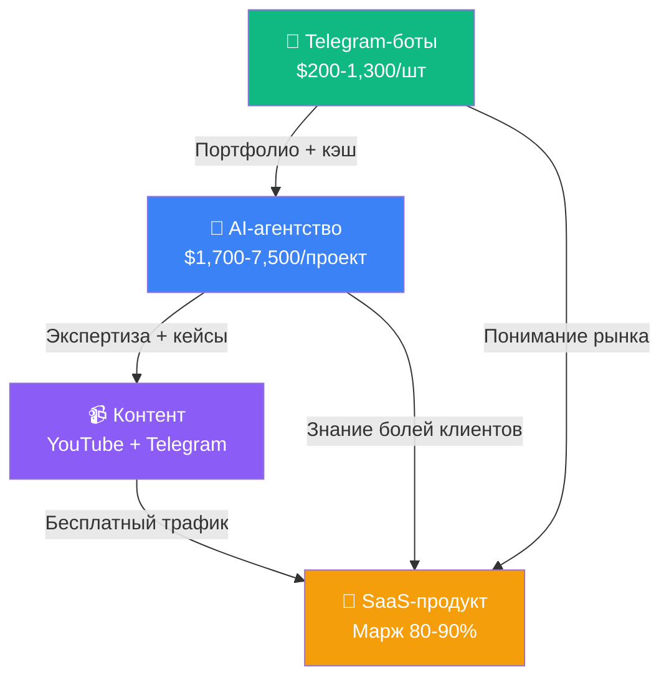

# 🔬 Глубокий анализ: Все возможности для соло-предпринимателя в Астане

## Обновлённая версия после детального исследования (Июнь 2026)

---

# ЧАСТЬ 1: ТОП-2 — ПЕРЕОЦЕНКА ПОСЛЕ ГЛУБОКОГО АНАЛИЗА

---

## 💎 Идея #1: IS ESF / Налоговая автоматизация

### Что выяснилось

> [!WARNING]
> **Техническая сложность ВЫШЕ, чем ожидалось.** IS ESF использует SOAP/XML (не REST), ГОСТ-криптографию (KalkanCrypt DLL — только Windows), и ЭЦП-авторизацию. Это не «сделал за 3 недели на Supabase».

### Технический стек IS ESF (государственный)
| Компонент | Технология |
|-----------|-----------|
| Протокол | SOAP Web Services (WSDL) |
| Формат данных | XML с XSD-схемами |
| Криптография | ГОСТ 2015 (KalkanCrypt DLL) |
| Авторизация | ЭЦП + тикеты через AuthService |
| Клиент | NCALayer (браузерный плагин) |
| Продакшн | `esf.gov.kz:8443` |
| Тест | `test3.esf.kgd.gov.kz:8443` |

### Конкуренты — их МНОГО

```
🏢 Тяжеловесы:
   ├── 1С:ЭСФ для Казахстана (бесплатно с ИТС ПРОФ, доп. БИН — 600₸/мес)
   ├── 1С:Рейтинг (отраслевые решения)
   └── 1cfresh.kz (облачная 1С с ЭСФ)

☁️ Онлайн-бухгалтерия (SaaS):
   ├── BigBuh.kz — от 4,499₸/мес (всё включено)
   ├── MyBuh.kz — онлайн бухгалтерия + аутсорсинг
   ├── Asistent.kz — облачная бухгалтерия, ЭСФ/ЭАВР/СНТ
   └── Reportix.kz — автоматизация налоговой отчётности

🏪 Торговая автоматизация (с ЭСФ):
   ├── Paloma365 — ритейл, HoReCa, интеграция с Kaspi
   ├── UMAG — розница, аптеки, СНТ
   ├── ProSklad — склад + ЭСФ/СНТ
   └── Entera.kz — авто-загрузка первички в 1С

📱 Государственные:
   ├── IS ESF Web Portal (esf.gov.kz)
   ├── IS ESF мобильное приложение
   └── e-Salyq Business (для ИП на упрощёнке)
```

### Размер рынка (реальный)
| Сегмент | Количество |
|---------|-----------|
| Плательщики НДС | ~146,000 |
| ИП на упрощёнке (теперь ОБЯЗАНЫ) | ~1.2 млн |
| Мед. услуги, фарма, адвокаты | Десятки тысяч |
| **Консервативный TAM** | **400,000–500,000** |
| **Расширенный TAM** | **1.5–2.0 млн** |

### Боли пользователей (реальные, с форумов)
1. ⏱️ **Портал падает** в пиковые периоды отчётности
2. 😤 **Ручная маркировка НДС-кредитов** — огромный новый объём работы (было автоматически, стало вручную)
3. 🔄 **Коды единиц измерения** не совпадают между 1С и ИС ЭСФ
4. 🚫 **Невозможно легко исправить ошибку** — нужен полный отзыв и перевыпуск
5. 🔑 **ЭЦП сертификаты** истекают, NCALayer падает, ГОСТ 2015 ломает интеграции
6. 👤 **Биометрия** блокирует срочную выписку для «рисковых» налогоплательщиков

### Пересмотренная оценка

| Параметр | Было | Стало |
|----------|------|-------|
| Конкуренция | 🟢 Низкая | 🟡 **Средняя** — много игроков, но UX ужасный у всех |
| Техническая сложность | 🟢 Простая | 🔴 **Высокая** — ГОСТ-крипто, SOAP, Windows DLL |
| MVP за | 3-4 недели | **8-12 недель** минимум |
| Стек | Supabase + n8n | **Нужен бэкенд на C#/Java/Python + KalkanCrypt** |

> [!CAUTION]
> **Вердикт: НЕ рекомендую как первый проект.** Технические барьеры слишком высоки для соло-старта с минимальным бюджетом. ГОСТ-криптография и SOAP — это не то, что быстро делается на Supabase. Но это ОТЛИЧНЫЙ второй проект после того, как наберёшь опыт и команду.

---

## 💎 Идея #2: Kaspi Middleware / Bridge API

### Что выяснилось

> [!IMPORTANT]
> **Хорошая новость**: У Kaspi ЕСТЬ официальные API (Marketplace + Pay). **Плохая новость**: Уже есть несколько игроков, и рынок не такой пустой, как казалось.

### Kaspi API — что реально доступно

**A. Kaspi Shop (Marketplace) API:**
- RESTful, JSON (`application/vnd.api+json`)
- Доступ через токен в кабинете продавца
- Возможности: заказы, товары, категории, цены, остатки, доставка
- ⚠️ Нужен контракт с Kaspi как партнёр

**B. Kaspi Pay API:**
- Продакшн: `pay.kaspi.kz`, Тест: `testpay.kaspi.kz`
- Создание счетов, платёжные ссылки, QR-коды, вебхуки
- HMAC-SHA256 подписи
- ⚠️ Нужен контракт с Kaspi Bank + KYC

### Конкуренты — карта рынка

```
💳 Платёжная автоматизация:
   ├── ApiPay.kz — от 10,000₸/мес, SDK (Python/PHP/JS), n8n-нода
   ├── AiPay.kz — конкурент ApiPay, авто-подтверждение платежей
   └── KPAY — CRM-интеграция (Bitrix24, AmoCRM)

📦 Маркетплейс-интеграция:
   ├── Api Monster — no-code, Kaspi → AmoCRM/Bitrix24/RetailCRM/МойСклад
   ├── MoySklad.kz — склад + Kaspi + Wildberries + Ozon
   ├── Billz — мульти-маркетплейс заказы
   └── PVZ HUB — логистика ПВЗ для Kaspi/Ozon/WB

📊 1С интеграции (огромная экосистема):
   ├── ITsheff — авто-импорт заказов Kaspi → 1С
   ├── Эдванс — синхронизация цен/остатков 1С → Kaspi
   ├── Cybernetica — Kaspi QR в 1С
   └── 5+ других франчайзи
```

### Масштаб Kaspi (Q1 2026)
| Метрика | Данные |
|---------|--------|
| Активные продавцы (КЗ) | **750,000+** |
| MAU | **14.8 млн** |
| Payments TPV (Q1 2026) | **$23.7 млрд** (+14% YoY) |
| Marketplace GMV (Q1 2026) | **$4.5 млрд** (+19% YoY) |
| Транзакций в месяц на юзера | **77** |

### Где РЕАЛЬНО есть дыры

| Гэп | Кто решает | Насколько пусто |
|-----|-----------|----------------|
| **Единый дашборд Kaspi + WB + Ozon** | Никто полноценно | 🟢 Пусто |
| **Аналитика продаж** (у Kaspi нет analytics API) | Никто | 🟢 Пусто |
| **Автоматический репрайсинг** | Никто | 🟢 Пусто |
| **Рекламная аналитика Kaspi** (нет API для рекламы) | Никто | 🟢 Пусто |
| **Финансовая сверка** (платежи ↔ заказы ↔ бухгалтерия) | Частично 1С | 🟡 Слабо покрыто |
| Платёжная автоматизация | ApiPay, AiPay | 🔴 Покрыто |
| Маркетплейс → CRM | Api Monster | 🟡 Покрыто, но сыро |

### Пересмотренная оценка

| Параметр | Было | Стало |
|----------|------|-------|
| Конкуренция | 🟢 Очень низкая | 🟡 **Средняя** — игроки есть, но в узких нишах |
| Лучший вход | «Общий middleware» | **Аналитика продавцов (Kaspi + WB + Ozon)** |
| MVP за | 2-3 недели | **3-4 недели** (для аналитики) |
| Стек | Подходит | ✅ **Supabase + n8n + фронт** — идеально |

> [!TIP]
> **Вердикт: Жизнеспособно, но нужен фокус.** Не строй «общий middleware» — это уже занято. Строй **аналитику и автоматизацию для мультиканальных продавцов** (Kaspi + WB + Ozon в одном месте). Этого НЕТ ни у кого.

---

# ЧАСТЬ 2: АЛЬТЕРНАТИВНЫЕ БИЗНЕС-МОДЕЛИ (за пределами SaaS)

---

## 🏆 #1. AI-Агентство / Автоматизация (⭐⭐⭐⭐⭐)

> [!IMPORTANT]
> **Это ЛУЧШИЙ вариант для старта.** Нулевые вложения, мгновенный доход, идеально ложится на стек (n8n, AI, Supabase), и строит портфолио для будущего SaaS.

### Расценки в Казахстане (реальные)
| Уровень | Что входит | Срок | Цена |
|---------|-----------|------|------|
| Quick Win | Чат-бот, один n8n-workflow | 2-3 нед | от $1,700 |
| Отдел | 3-5 процессов (CRM, документы) | 5-10 нед | $6,500–$7,500 |
| Кросс-функциональный | 10+ процессов, мульти-агенты | 3-5 мес | $12,000–$21,000 |
| Enterprise | Полная AI-платформа | 4-12 мес | $32,000–$52,000+ |

### Конкуренты
- AISol.kz, ICNX.kz, Mudryi Digital, ilink, instinctools
- НО: ~24% компаний КЗ нуждаются во **внешних** AI-консультантах (дефицит кадров)

### Реалистичный доход (соло)
| Период | Доход/мес |
|--------|----------|
| Месяц 1-3 | $0–$500 (портфолио, пилоты) |
| Месяц 3-6 | $1,700–$3,400 (1-2 проекта) |
| Месяц 6-12 | $3,000–$7,000 (ретейнеры + проекты) |
| Год 2+ | $5,000–$10,000 |

---

## 🏆 #2. Telegram-боты для бизнеса (⭐⭐⭐⭐⭐)

### Почему это огонь
- **12.5 млн** пользователей Telegram в КЗ — доминирующий мессенджер
- Telegram Bot API — **бесплатный** (vs WhatsApp Business API — платный)
- Бизнесы используют: каталоги, запись, логистика, поддержка, оплата через Kaspi Pay

### Расценки в КЗ
| Тип бота | Цена | Срок |
|----------|------|------|
| Базовый (FAQ/инфо) | $200–$300 | 5-7 дней |
| Бизнес (CRM + оплата Kaspi) | $700–$1,300 | 2-3 нед |
| AI-powered / премиум | $2,600+ | 3-8 нед |

### Реалистичный доход (соло)
- 3-4 базовых + 1-2 бизнес бота/мес → **$2,000–$5,000/мес**
- Плюс обслуживание/поддержка → пассивный доход

---

## 🥈 #3. White-Label SaaS Reselling (⭐⭐⭐⭐)

### Суть
Берёшь готовый SaaS (CRM, email-маркетинг, автоматизация) → брендируешь под себя → продаёшь локальным SME с локализацией и поддержкой на русском/казахском.

### Горячие ниши
- **CRM/маркетинг** (HighLevel, ActiveCampaign)
- **Голосовая автоматизация** (Zvonobot.kz — прецедент)
- **E-commerce инструменты** (управление магазином)
- **HR/Payroll** (с локальным compliance)

### Доход
- 5-10 клиентов SME → **$2,500–$6,000/мес**
- Стартовые расходы: $50–$300/мес (подписка на white-label)

---

## 🥈 #4. AI-маркетинговое агентство (⭐⭐⭐⭐)

### Суть
Контент-генерация, таргет, SEO, SMM — но с AI-инструментами ты делаешь за 2 часа то, что обычное агентство делает за 2 дня.

### Доход
- 2-3 малых клиента → $2,000–$4,000/мес
- С апселлом ботов + автоматизация → **$3,000–$7,000/мес**

---

## 🥉 #5. Контент / Образование / Инфопродукты (⭐⭐⭐⭐)

### Ландшафт
- **Нет доминирующего** tech/AI YouTube-блогера из КЗ на русском
- Coursera интегрирована в 95+ вузов КЗ, Stepik популярен
- Локальные буткемпы: Alem School, nFactorial, Academy IQ+

### Стратегия
1. YouTube-канал (туториалы по n8n, AI, автоматизация) — бесплатный трафик
2. Telegram-канал (10K+ подписчиков) — $500–$1,500/мес от рекламы
3. Курсы на Stepik или свой — $500–$2,000/мес
4. **Комбинированный доход: $1,000–$4,000/мес**

### Долгосрочная ценность
- Контент строит личный бренд → клиенты приходят сами
- Это **маркетинговый канал** для всех остальных бизнесов

---

## 🥉 #6. Мульти-маркетплейс аналитика (Kaspi + WB + Ozon) (⭐⭐⭐⭐)

### Суть (обновлённая версия Kaspi Middleware)
Не «middleware для Kaspi» (уже занято), а **единый дашборд продавца** для всех маркетплейсов: Kaspi + Wildberries + Ozon + Halyk Market. Аналитика, репрайсинг, финансовая сверка.

### Почему именно это
- Такого инструмента **НЕТ** в Казахстане
- 750K+ продавцов на Kaspi, растущие WB и Ozon
- Боль: ручное управление ценами/остатками/заказами в 3-4 кабинетах

### Стек
- Supabase (auth, DB, realtime) + n8n (синхронизация данных) + фронт (дашборд)
- Через официальные API маркетплейсов

### Доход
- SaaS: $20–$100/мес × продавцы
- Цель: 200 продавцов → **$4,000–$20,000/мес**
- MVP: 4-6 недель

---

## 💡 Бонус: Экзотика

| Идея | Бюджет | Доход/мес | Риск |
|------|--------|----------|------|
| **Крипто-консалтинг (AIFC)** | ~$0 | $1,000–$3,000 | 🟡 Регуляция сложная |
| **Digital Nomad сервисы** (Neo Nomad visa помощь) | ~$0 | $800–$3,000 | 🟢 Низкий |
| **E-commerce арбитраж** (Kaspi) | $500–$2,000 | $500–$2,000 | 🔴 Высокий |
| **Гранты** (Astana Hub Seed Money) | $0 | До $20K разово | 🟡 Конкурс |
| **Вендинг + IoT** | $10,000+ | $500–$5,000 | 🟡 Капитал нужен |

---

# ЧАСТЬ 3: ИТОГОВЫЙ РЕЙТИНГ

## Все возможности в одной таблице

| # | Возможность | Стартовые расходы | Время до дохода | Доход/мес (реал.) | Подходит стек? | Конкуренция | ИТОГО |
|---|------------|-------------------|----------------|-------------------|---------------|-------------|-------|
| 1 | **AI-агентство + автоматизация** | $0 | 1-3 мес | $2,000–$7,000 | ✅ Идеально | 🟡 Средняя | ⭐⭐⭐⭐⭐ |
| 2 | **Telegram-боты для бизнеса** | $0 | 1-2 нед | $1,500–$5,000 | ✅ Идеально | 🟡 Средняя | ⭐⭐⭐⭐⭐ |
| 3 | **White-label SaaS** | $50–$300/мес | 1-2 мес | $2,500–$6,000 | ✅ Хорошо | 🟢 Низкая | ⭐⭐⭐⭐ |
| 4 | **AI-маркетинг агентство** | $0–$200 | 1-2 мес | $2,000–$5,000 | ✅ Хорошо | 🟡 Средняя | ⭐⭐⭐⭐ |
| 5 | **Контент/YouTube/курсы** | $0–$500 | 3-6 мес | $1,000–$4,000 | ✅ Хорошо | 🟢 Низкая | ⭐⭐⭐⭐ |
| 6 | **Мульти-маркетплейс SaaS** | $0 | 2-3 мес | $4,000–$20,000 | ✅ Идеально | 🟢 Низкая | ⭐⭐⭐⭐ |
| 7 | **Kaspi аналитика (узко)** | $0 | 2-3 мес | $2,000–$10,000 | ✅ Хорошо | 🟢 Низкая | ⭐⭐⭐⭐ |
| 8 | **IS ESF / налоги** | $0 | 3-6 мес | $3,000–$15,000 | ⚠️ Нужен доп. стек | 🟡 Средняя | ⭐⭐⭐ |
| 9 | **Blue-collar гиг-платформа** | $0 | 2-3 мес | $1,000–$5,000 | ✅ Хорошо | 🟢 Низкая | ⭐⭐⭐ |
| 10 | **Digital nomad сервисы** | $0 | 1-2 мес | $800–$3,000 | ✅ Хорошо | 🟢 Низкая | ⭐⭐⭐ |

---

# 🎯 РЕКОМЕНДОВАННАЯ СТРАТЕГИЯ

## Фаза 1: Быстрый кэш (Месяц 1-3)

```
📌 ОСНОВА: Telegram-боты + AI-автоматизация

1. Зарегистрируйся в Astana Hub → 0% налогов
2. Сделай 2-3 демо-бота (каталог + Kaspi Pay, запись в салон, FAQ-бот)
3. Продавай локальным бизнесам: салоны, кафе, магазины
4. Параллельно предлагай n8n-автоматизацию (CRM, уведомления, отчёты)

💰 Цель: $1,500-$3,000/мес
```

## Фаза 2: Масштабирование (Месяц 3-6)

```
📌 ДОБАВЬ: Контент + White-label

1. Начни YouTube-канал / Telegram-канал (туториалы по автоматизации)
2. Клиенты из контента приходят бесплатно
3. Добавь white-label CRM/маркетинг для существующих клиентов
4. Рассмотри гранты Astana Hub (Seed Money до $20K)

💰 Цель: $3,000-$7,000/мес
```

## Фаза 3: Продукт (Месяц 6-12)

```
📌 СТРОЙ SaaS: Мульти-маркетплейс аналитику

1. К этому моменту ты знаешь боли продавцов из первых рук
2. У тебя есть аудитория (YouTube/Telegram) для бесплатного маркетинга
3. У тебя есть деньги от агентства для самофинансирования
4. Строй на Supabase + n8n — твой стек

💰 Цель: $5,000-$15,000/мес
```

## Почему эта стратегия работает



> [!TIP]
> **Ключевая идея:** Не начинай с SaaS-продукта (долго, рискованно, нет обратной связи). Начни с **сервиса** (боты + автоматизация) → узнай реальные боли → построй продукт на основе реального спроса. Деньги с агентства финансируют разработку продукта. Контент привлекает клиентов бесплатно.

---

# 📋 Первые 7 дней — конкретный план

| День | Действие |
|------|---------|
| **1** | Зарегистрируйся в Astana Hub (astanahub.com). Подготовь портфолио-сайт |
| **2** | Сделай демо Telegram-бота (каталог товаров + Kaspi Pay через ApiPay.kz) |
| **3** | Сделай второй демо (бот записи для салона/клиники) |
| **4** | Создай Instagram/Telegram с кейсами. Сделай 5 постов |
| **5** | Обойди 10 локальных бизнесов в Астане с демо на телефоне |
| **6** | Начни первый YouTube-ролик: «Как я сделал Telegram-бота за 2 часа» |
| **7** | Первый платящий клиент или бесплатный пилот с обещанием отзыва |

---

## ⚡ Что нужно решить прямо сейчас

1. **Какое направление резонирует больше**: сервис (боты/агентство) или продукт (SaaS)?
2. **Готов ли ты продавать лично** (ходить по бизнесам) или только онлайн?
3. **Хочешь начать строить что-то прямо сейчас?** Могу сделать демо-бота, лендинг или MVP.
