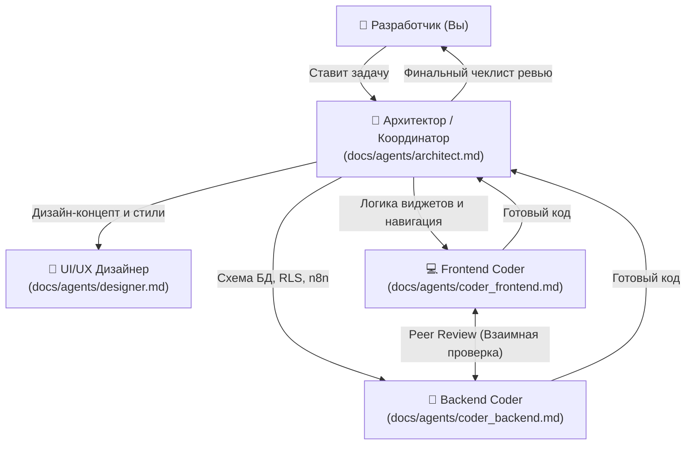

# 📖 Animora: Инструкции для ИИ-агентов (AI Guidelines & Context Keeper)

Этот документ является **"хранителем контекста" (Context Keeper)** для любого ИИ-агента, подключающегося к проекту **Animora**. Он содержит инструкции о том, как сохранять память проекта, ориентироваться в коде, логировать ошибки и координировать работу команды агентов.

---

## 💾 1. Как сохранять память проекта (Context Keeping)

Чтобы ИИ-агент «не терялся» и помнил всю историю разработки, каждый агент обязан строго следовать двум правилам:

### А. Обновление журнала ошибок при решении проблем
При обнаружении и исправлении любых багов компиляции, сборки или работы базы данных, вы **обязаны** внести запись в [docs/error_log.md](file:///c:/Projects/docs/error_log.md):
1.  **Симптом:** Текст ошибки или описание неправильного поведения UI.
2.  **Причина:** Почему возникла ошибка (конфликт версий, опечатка, неверный тип данных).
3.  **Решение:** Конкретный кусок кода или SQL-запрос, который исправил проблему.

### Б. Обновление карты проекта при создании файлов
Если вы создаете новые файлы, папки или таблицы в БД:
1.  Внесите изменения в схему каталогов в [docs/project_map.md](file:///c:/Projects/docs/project_map.md).
2.  Дайте краткое описание назначения новой папки или файла.

---

## 👥 2. Система специализированных агентов (Multi-Agent Flow)

Для крупных задач рекомендуется разделять роли и запускать специализированных субагентов. Все промты для них хранятся в папке `docs/agents/`.

### Как распределять работу по ролям:

1.  **Архитектор (Координатор):**
    *   Анализирует задачу, делит её на подзадачи во [docs/task.md](file:///c:/Projects/docs/task.md).
    *   Проверяет соответствие архитектурным принципам (SoC, Riverpod Notifier, Локализация).
    *   Проводит финальный Code Review перед коммитом.
2.  **UI/UX Дизайнер:**
    *   Проверяет тему (светлая/темная), радиусы скруглений (14-20px), шрифты (Inter).
    *   Проверяет отсутствие жестко прописанных цветов (только `Theme.of(context).colorScheme`).
    *   Добавляет микро-анимации (`Hero`, `AnimatedContainer`, `Transitions`).
3.  **Разработчик Фронтенда (Coder 1):**
    *   Пишет код виджетов и Notifier'ов Riverpod.
    *   Интегрирует локализацию `.tr()`.
    *   Настраивает роутинг GoRouter.
4.  **Разработчик Бэкенда (Coder 2):**
    *   Развертывает SQL-миграции, пишет триггеры/функции в Supabase.
    *   Включает RLS и пишет политики безопасности.
    *   Разрабатывает интеграционные сценарии n8n.

---

## 🛠️ 3. Как запускать субагентов в IDE

Вам не нужно ничего скачивать или устанавливать. Все эти агенты запускаются динамически из вашего чата с помощью встроенных инструментов. 

При постановке крупной задачи вы можете запустить субагента, передав ему соответствующую инструкцию из папки `docs/agents/`:
*   *Пример команды в чате:* 
    > «Создай субагента Frontend Coder с промтом из `docs/agents/coder_frontend.md` и поручи ему сверстать новый экран медкарты питомца согласно ТЗ.»
