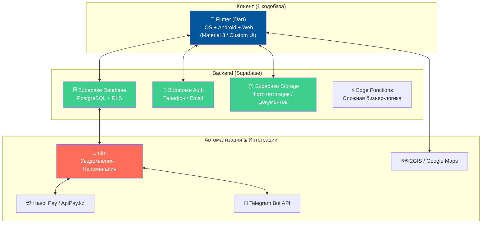

# 🐾 Pet-суперапп: План разработки (Flutter & Dart)

---

## 🏗️ Стек технологий: Выбор в пользу Dart & Flutter

Переход на **Flutter (Dart)** — отличное решение, так как у вас уже есть базовый опыт в FlutterFlow, а сам фреймворк обеспечивает великолепную производительность на iOS, Android и Web из единой кодобазы.



### Детали клиентского стека

| Компонент | Технология / Пакет | Зачем |
|------|-----------|-------|
| **Основа** | SDK Flutter (Dart) | Кроссплатформенность (iOS, Android, Web) |
| **Навигация** | `go_router` | Удобный роутинг с поддержкой ролей и веб-URL |
| **База & Auth** | `supabase_flutter` | Официальный SDK для работы с Supabase |
| **Стейт-менеджмент**| `flutter_riverpod` или `provider` | Управление состоянием приложения |
| **Карты** | `google_maps_flutter` / 2GIS Webview | Карта клиник и салонов Астаны |
| **UI библиотека** | Material 3 + Custom Shaders / Animations | Премиальный, отзывчивый интерфейс |
| **Локальные данные**| `shared_preferences` или `hive` | Кэширование настроек и сессии |

---

## 👥 Два интерфейса: Владелец (Owner) vs Провайдер (Provider)

Приложение будет использовать **ролевую модель** на уровне базы данных Supabase. Интерфейс динамически переключается в зависимости от роли вошедшего пользователя.

### Структура проекта (Flutter / Dart)

```
lib/
├── main.dart                  # Точка входа, инициализация Supabase
├── app.dart                   # Корневой виджет, настройка темы и GoRouter
├── core/                      # Общие утилиты, константы, стили
│   ├── theme/                 # Цветовые схемы, шрифты
│   ├── constants/             # Ссылки, ключи
│   └── utils/                 # Валидаторы, форматирование дат
│
├── data/                      # Работа с сетью и Supabase
│   ├── models/                # Модели (Pet, Booking, Provider, Service)
│   └── repositories/          # Запросы к Supabase (Auth, Bookings, Services)
│
├── providers/                 # Riverpod / State Providers
│   ├── auth_provider.dart     # Состояние авторизации и роли
│   └── booking_provider.dart  # Управление записями
│
└── presentation/              # UI Экраны (Разделение по ролям)
    ├── auth/                  # Вход, регистрация, выбор роли
    │   ├── screens/login_screen.dart
    │   └── screens/role_selection_screen.dart
    │
    ├── owner/                 # Интерфейс ВЛАДЕЛЬЦА
    │   ├── navigation/owner_tab_scaffold.dart
    │   ├── screens/home_screen.dart       # Карта + категории
    │   ├── screens/search_screen.dart     # Поиск услуг
    │   ├── screens/pet_list_screen.dart   # Питомцы
    │   ├── screens/booking_flow.dart      # Процесс записи
    │   └── screens/health_card_screen.dart# Мед.карта
    │
    └── provider/              # Интерфейс КЛИНИКИ / ГРУМЕРА
        ├── navigation/provider_tab_scaffold.dart
        ├── screens/dashboard_screen.dart  # Записи на сегодня, статистика
        ├── screens/calendar_screen.dart   # Календарь слотов
        ├── screens/services_screen.dart   # CRUD услуг и цен
        └── screens/business_profile.dart  # Настройки клиники
```

---

## 🛠️ Архитектура БД (Supabase)

Схема базы данных остается единой и надежной. RLS (Row Level Security) правила гарантируют безопасность данных.

```sql
-- Таблица профилей пользователей
create table public.profiles (
  id uuid references auth.users on delete cascade primary key,
  phone text unique,
  full_name text,
  avatar_url text,
  role text check (role in ('owner', 'provider', 'admin')),
  created_at timestamptz default timezone('utc'::text, now()) not null
);

-- Таблица питомцев
create table public.pets (
  id uuid default gen_random_uuid() primary key,
  owner_id uuid references public.profiles(id) on delete cascade not null,
  name text not null,
  species text check (species in ('dog', 'cat', 'bird', 'exotic')),
  breed text,
  birth_date date,
  weight float,
  photo_url text,
  microchip_id text,
  created_at timestamptz default timezone('utc'::text, now()) not null
);

-- Таблица клиник/салонов (Провайдеров)
create table public.providers (
  id uuid default gen_random_uuid() primary key,
  profile_id uuid references public.profiles(id) on delete cascade not null,
  business_name text not null,
  type text check (type in ('vet_clinic', 'grooming', 'hotel', 'walking')),
  description text,
  address text not null,
  lat float,
  lng float,
  phone text,
  photos text[],
  working_hours jsonb,
  rating float default 5.0,
  review_count int default 0,
  verified boolean default false
);

-- Услуги, предоставляемые клиниками/салонами
create table public.services (
  id uuid default gen_random_uuid() primary key,
  provider_id uuid references public.providers(id) on delete cascade not null,
  name text not null,
  description text,
  price int not null, -- В тенге
  duration_min int not null, -- Длительность в минутах
  category text,
  active boolean default true
);

-- Записи на прием (Бронирования)
create table public.bookings (
  id uuid default gen_random_uuid() primary key,
  owner_id uuid references public.profiles(id) not null,
  provider_id uuid references public.providers(id) not null,
  pet_id uuid references public.pets(id) not null,
  service_id uuid references public.services(id) not null,
  booking_time timestamptz not null,
  status text check (status in ('pending', 'confirmed', 'completed', 'cancelled')) default 'pending',
  notes text,
  price int not null,
  created_at timestamptz default timezone('utc'::text, now()) not null
);
```

---

## 🎯 Phase 0: MVP-Демо для показа клиникам (Сроки: 1 неделя)

> [!IMPORTANT]
> **Цель:** Создать рабочее Flutter-приложение (запускается на вашем телефоне или в Web), с помощью которого вы сможете прийти в клинику/салон в Астане и показать:
> 1. Как клиент видит их заведение на карте города и в каталоге.
> 2. Как быстро клиент может записаться на вакцинацию или стрижку.
> 3. Как клиника мгновенно получает эту запись в своем личном кабинете.

### Сценарий демонстрации (User Flow):
1. **Экран Owner (Главная)**: Карта Астаны (2GIS/Google) с нанесенными реальными ветклиниками (например, «Astana», «Догма») и грумингами («Red Hot Chili Pets»).
2. **Экран Деталей Клиники**: Список услуг с реальными ценами. Нажимаем «Записаться» → Выбираем тестовую собаку «Рекс» → Выбираем свободное время.
3. **Экран Переключения Роли** (скрытый переключатель для вас): Меняем роль на «Провайдер».
4. **Экран Dashboard Клиники**: Показывает уведомление о новой записи от пользователя, данные собаки (порода, возраст), кнопку «Подтвердить».

---

## 🤔 Важный выбор: Чистый Flutter (Dart) VS FlutterFlow

Так как вы знакомы с FlutterFlow, у нас есть два пути реализации MVP:

### Вариант А: FlutterFlow + Supabase (Визуальный конструктор)
* **Плюсы**: Очень быстро собирается интерфейс (драг-н-дроп), автоматически генерируется код верстки, встроенная интеграция с Supabase.
* **Минусы**: Ограничения бесплатного тарифа FlutterFlow (нельзя экспортировать код, лимит на API запросы), сложнее делать нетривиальную логику переключения ролей в одном приложении.
* **Как работаем**: Вы собираете макеты во FlutterFlow, я пишу для вас сложные **Custom Actions**, **Custom Widgets** на Dart и проектирую схему Supabase.

### Вариант Б (Рекомендуемый): Чистый Flutter (Dart) проект
* **Плюсы**: Полная свобода, абсолютно бесплатно, чистый и расширяемый код, легкая настройка ролей, проект принадлежит только вам.
* **Минусы**: Нужно писать код верстки вручную (но я помогу написать его быстро и качественно).
* **Как работаем**: Я создаю структуру проекта, пишу чистый код экранов на Dart с использованием Material 3, настраиваю работу с Supabase. Вы запускаете проект у себя на ПК/телефоне через VS Code / Android Studio, учитесь читать код и вносите правки.

---

## 🚀 Вопросы для обсуждения перед стартом:

> [!IMPORTANT]
> 1. **Какой вариант разработки выберем?** Чистый Flutter (Вариант Б, где мы пишем код) или FlutterFlow (Вариант А, где я помогаю вам с логикой и Custom Actions)?
> 2. **Название приложения**: Какое имя вам нравится больше? **Taban** (лапа / подошва — каз.), **Dostym** (мой друг — каз.), **PawMate** или другое?
> 3. **Локализация**: Делаем MVP только на русском языке или сразу заложим русский + казахский (через Flutter `easy_localization` / FlutterFlow Multi-language)?
> 4. **Данные клиник**: Нам нужны 3-5 реальных адресов ветклиник и салонов Астаны, которые вы планируете посетить в первую очередь. Какие заведения запишем в демо-базу?

---

### Что делаем дальше?
Как только вы ответите на эти вопросы и подтвердите этот план, мы создадим `task.md` и приступим к разработке MVP на Dart/Flutter!
