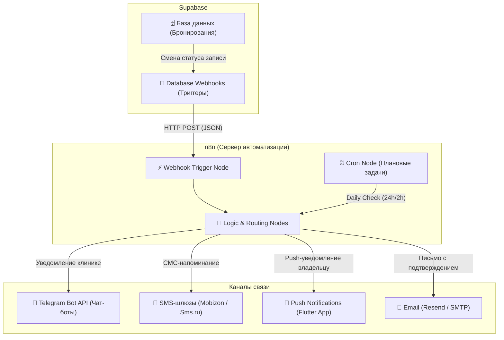

# ⚡ Animora: План интеграции n8n (Уведомления и автоматизация)

Этот документ описывает архитектуру автоматизации для приложения **Animora** с использованием **n8n** (self-hosted или cloud). n8n выступает в роли "нервной системы" бэкенда, связывая Supabase, Telegram Bot API и Push-уведомления.

---

## 🏗️ Общая схема интеграции



---

## 📋 Рабочие процессы n8n (Workflows)

Для MVP нам понадобятся **3 ключевых процесса**. Ниже описана логика и узлы (nodes) для каждого из них.

### Процесс 1: Мгновенное уведомление клиники о новой записи
**Триггер:** Создание новой записи в таблице `bookings` со статусом `pending`.

1. **Supabase Webhook Node (Trigger):** 
   - Вызывает вебхук n8n при `INSERT` в таблицу `bookings`.
   - Передает JSON с `id` записи, `owner_id`, `provider_id`, `service_id` и `booking_time`.
2. **Supabase Query Node (Fetch Details):**
   - Делает запрос в Supabase для получения имени клиента, телефона, имени питомца и названия услуги по их `id`.
3. **Telegram Node (Send to Provider):**
   - Отправляет сообщение в приватную группу или напрямую администратору клиники:
     > 🔔 **Новая заявка в Animora!**
     > *   **Услуга:** Стерилизация кошки
     > *   **Питомец:** Мурка (Британская)
     > *   **Клиент:** Александр (+7 701 555-5555)
     > *   **Время:** 18 июня в 14:00
     > 
     > [Подтвердить в приложении](https://animora.kz/provider)

---

### Процесс 2: Уведомление клиента о подтверждении / отмене
**Триггер:** Обновление статуса записи в таблице `bookings` (статус стал `confirmed` или `cancelled`).

1. **Supabase Webhook Node (Trigger):**
   - Срабатывает на `UPDATE` в таблице `bookings`, если изменилось поле `status`.
2. **Switch Node (Routing):**
   - Если статус = `confirmed` -> переход на ветку «Подтверждено».
   - Если статус = `cancelled` -> переход на ветку «Отменено».
3. **HTTP Request Node (Push Notification):**
   - Отправляет POST-запрос на FCM (Firebase Cloud Messaging) или сервис Expo Notifications (в зависимости от настройки сборки Flutter) для отправки нативного push-уведомления на телефон владельца:
     > **Запись подтверждена!**
     > Ветклиника «Любимчик» ждет вас и Шарика 18 июня в 12:00.

---

### Процесс 3: Умные напоминания за 24 часа и 2 часа (Сron)
Этот процесс работает по времени, а не по событиям. Он предотвращает неявки клиентов.

1. **Cron Node (Trigger):**
   - Срабатывает каждый час (например, `0 * * * *`).
2. **Supabase SQL Node (Fetch Bookings):**
   - Выполняет запрос к базе данных, чтобы найти записи со статусом `confirmed`, время приема которых наступит ровно через 24 часа (или 2 часа).
   - SQL Пример:
     ```sql
     SELECT b.*, p.phone as client_phone, pr.business_name, pet.name as pet_name 
     FROM bookings b
     JOIN profiles p ON b.owner_id = p.id
     JOIN providers pr ON b.provider_id = pr.id
     JOIN pets pet ON b.pet_id = pet.id
     WHERE b.status = 'confirmed' 
       AND b.booking_time >= now() + interval '23 hours' 
       AND b.booking_time <= now() + interval '25 hours';
     ```
3. **SMS / Telegram / Push Node:**
   - Отправляет клиенту напоминание:
     > Напоминание: Завтра в 12:00 вы записаны в «Любимчик» на вакцинацию с питомцем Шарик.

---

## 🛠️ Как развернуть n8n локально

Для разработки и тестирования проще всего запустить n8n на вашем компьютере через Docker.

1. Установите Docker Desktop.
2. Откройте терминал (PowerShell) и запустите команду:
   ```bash
   docker run -d --name n8n -p 5678:5678 -v n8n_data:/home/node/.n8n n8nio/n8n
   ```
3. Откройте в браузере `http://localhost:5678`.
4. Создайте учетную запись администратора. n8n готов к работе!

---

## 🚀 Настройка вебхуков между Supabase и n8n (Local Tunnel)

Поскольку Supabase Cloud не может отправлять запросы на ваш локальный компьютер (`localhost`), вам понадобится временный туннель для тестирования вебхуков (например, **ngrok** или встроенный в n8n **tunnel**).

**Вариант с ngrok:**
1. Скачайте ngrok и запустите:
   ```bash
   ngrok http 5678
   ```
2. Скопируйте полученный адрес вида `https://xxxx.ngrok-free.app`.
3. В n8n используйте этот адрес как базовый для Webhook-нод.
4. В консоли Supabase (Database -> Webhooks) укажите этот URL для отправки уведомлений.
