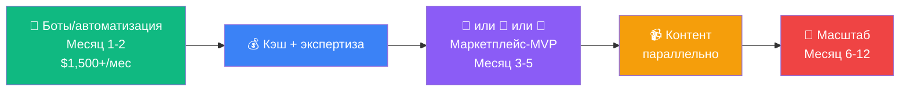

# 🔍 Жизнь людей в Астане: Новые бизнес-возможности
## Расширенное исследование (Июнь 2026)

---

## 👤 Портрет жителя Астаны: Цифры, которые решают

### 💰 Деньги

| Показатель | Данные |
|-----------|--------|
| Средняя зарплата (Астана) | ₸610,000/мес (~$1,245) |
| **Медианная** зарплата (КЗ) | ₸331,500/мес (~$663) — реальнее |
| Минимальная | ₸85,000/мес (~$170) |
| На еду уходит | **~48% дохода** |
| На аренду | 25-50% зарплаты |
| Коммуналка (85 м²) | ₸40,000-45,000/мес |
| **Свободные деньги** | **Почти нет у большинства** |

### 📊 Долговая картина

> [!CAUTION]
> **90%+ экономически активного населения имеют активные кредиты.** Долг-к-зарплате = 50.7% (рекорд, выше кризиса 2008). Средняя ставка потреб. кредитов = 21.1%. Kaspi Red (BNPL) — главный драйвер розничного кредитования.

### 📱 Цифровое поведение
| Платформа | Охват |
|-----------|-------|
| Instagram | 14 млн+ (70%+ населения, #1) |
| WhatsApp | 85-89% молодёжи |
| TikTok | Доминирует у 6-24 лет |
| YouTube | Основной для длинного контента |
| Telegram | Растёт — новости + общение |
| Kaspi App | 80% взрослого населения |

### 🌡️ Жизнь по сезонам

```
🥶 ЗИМА (ноябрь-март): -30...-40°C
   ├── Жизнь перемещается в ТРЦ (Khan Shatyr, MEGA)
   ├── Доставка еды = необходимость, не роскошь
   ├── Аварии отопления = экстренный спрос на мастеров
   ├── Телефоны разряжаются моментально
   └── Депрессия, нехватка солнца → ментальное здоровье

☀️ ЛЕТО (июнь-август): +30...+35°C
   ├── Парки, Боровое, озёра
   ├── Свадебный сезон (пик)
   ├── Кондиционеры = дефицит мастеров
   └── Фестивали, концерты, открытые площадки
```

---

## 🆕 НОВЫЕ БИЗНЕС-ИДЕИ (из анализа жизни людей)

Эти идеи не были в предыдущих отчётах — они родились из понимания **быта, привычек и болей** реальных людей.

---

### 🐾 #1. Pet-сервисы: Суперапп для питомцев (⭐⭐⭐⭐⭐)

> [!IMPORTANT]
> **Самая быстрорастущая категория расходов в Астане.** Траты на ветуслуги выросли в **2.7 раза** за год. 50%+ всех ветрасходов КЗ — в Астане. Рынок → $500М+ к 2036 году.

**Данные:**
- 61,100 зарегистрированных животных в Астане (+27% за год)
- Расходы на вет: **₸17.8 млрд** в 2025 (₸9.6 млрд — Астана)
- Обязательное чипирование → все владельцы «в системе»
- Тренд «гуманизации» — питомцы = члены семьи

**Существующие решения (слабые):**
- OLX.kz, Profi.kz — просто доски объявлений
- Paws.kz, PetBacker — базовые
- Dikidi, Zapis.kz — общие платформы записи
- **Нет единого приложения** для всех потребностей владельца

**Идея:** Один апп = запись к ветеринару + груминг + выгул + pet-sitting + корм (подписка) + аптека + трекер здоровья + сообщество

| Параметр | Оценка |
|----------|--------|
| Конкуренция | 🟢 Почти нет спец. решений |
| Рост рынка | 🟢 7-9% CAGR, траты утроились |
| Стек | ✅ Supabase + n8n (уведомления, записи) + мобильный веб |
| Монетизация | Комиссия 10-15% + премиум подписка для владельцев + листинг для сервисов |
| MVP | 3-4 недели |
| Доход (12 мес) | **$2,000-$6,000/мес** |

**Почему сейчас:** Обязательное чипирование = база данных владельцев. Тренд «humanization» = готовность платить. Астана = 50%+ всего рынка.

---

### 🧠 #2. Онлайн-терапия / Маркетплейс психологов (⭐⭐⭐⭐⭐)

> [!IMPORTANT]
> **Обращения на линию «111» выросли с 17,000 (2024) до 110,000+ (нач. 2025) — рост в 6.5 раз.** Острый дефицит специалистов. Проблема «псевдо-психологов» (нет регуляции). Новый закон «О психологической деятельности» создаёт рынок верифицированных специалистов.

**Реальность:**
- Терапия нормализуется, особенно среди молодых (25-35 лет)
- Стигма снижается, но в старших поколениях ещё сильна
- **Дефицит врачей** — тысячи позиций незакрыты
- Онлайн-формат решает: анонимность, доступность, нет очередей
- Зимний Астана = сезонная депрессия, 5 месяцев без солнца

**Конкуренты:**
- B17.ru (российская платформа — не локализована под КЗ)
- DOQ.kz (общая запись к врачам, не специализирована на психологии)
- **Нет доминирующего казахстанского аналога Zigmund.Online / Yasno**

| Параметр | Оценка |
|----------|--------|
| Конкуренция | 🟢 Пусто в КЗ |
| Рост спроса | 🟢 Взрывной (6.5x за год) |
| Стек | ✅ Supabase (auth, профили, записи) + видео (Jitsi/Daily.co) + n8n (напоминания) |
| Монетизация | Комиссия 20-30% с сессии (₸8,000-15,000/сессия) + корп. программы |
| MVP | 4-5 недель |
| Доход (12 мес) | **$3,000-$10,000/мес** |

**Уникальное преимущество:** Верификация по новому закону (реестр психологов) = **доверие** в рынке, где «псевдо-специалисты» — главная проблема.

---

### 🚗 #3. Каршеринг в Астане (⭐⭐⭐⭐)

> [!WARNING]
> **В Астане НЕТ каршеринга.** Anytime работает только в Алматы. 500,000 машин на дорогах ежедневно. С июля 2026 — платные парковки. Идеальный момент.

**Контекст:**
- Машина = необходимость (общественный транспорт слабый, зимой -40°C)
- Платные парковки (с 12 июля 2026) → мотивация НЕ иметь своё авто
- Молодые (25-35) открыты к sharing-модели
- ЭВ без импортных пошлин → электро-каршеринг дешевле в эксплуатации

| Параметр | Оценка |
|----------|--------|
| Конкуренция | 🟢 **НОЛЬ** в Астане |
| Барьеры | 🔴 Нужен автопарк ($50K-200K+), страховка, техподдержка |
| Стек | Supabase + IoT (замки, GPS) + мобильный апп |
| Монетизация | Поминутная/почасовая аренда |
| Доход | Высокий, но **требует инвестиций** |

> [!TIP]
> **Вариант без капитала:** Начни как **P2P каршеринг** (владельцы сдают свои авто) — Turo-модель. Ты = платформа, не автопарк. Supabase + n8n + веб — всё что нужно.

---

### 💒 #4. WeddingTech — Свадебная платформа (⭐⭐⭐⭐)

**Масштаб рынка:**
- **115,000+ свадеб в год**
- Средняя стоимость: **₸8-25 млн ($16,000-50,000)**
- Рынок: **₸123 млрд — 1 трлн+** в год
- 100-200 гостей, банкет = 40-70% бюджета
- **Многие берут кредиты** на свадьбу

**Идея:** Платформа «тойхана + тамада + фотограф + декор + кейтеринг» = всё в одном. Агрегатор + бюджет-калькулятор + бронирование + отзывы.

| Параметр | Оценка |
|----------|--------|
| Конкуренция | 🟢 Нет доминанта в КЗ |
| Размер рынка | 🟢 Огромный — $250М-$820М в год только банкеты |
| Стек | ✅ Supabase + фронт |
| Монетизация | Комиссия 5-10% с букинга + featured listings + реклама |
| MVP | 3-4 недели |
| Доход (12 мес) | **$2,000-$8,000/мес** |

---

### ☪️ #5. Исламский финтех / Halal-лайфстайл (⭐⭐⭐⭐)

> [!IMPORTANT]
> **70% населения — мусульмане. Исламские финансы = 0.2% банковских активов.** Огромный гэп. AIFC предоставляет регуляторную рамку (Shariah Advisory Council, AAOIFI). Конвенциональные банки получили право открывать «исламские окна».

**Идеи внутри ниши:**
1. **Halal-инвестиции апп** — Shariah-compliant ETF, сукук, скрининг акций
2. **Halal-сертификация бизнесов** — консалтинг + платформа проверки
3. **Muslim lifestyle апп** — намаз, мечети, халяль-еда, Хадж/Умра поиск
4. **Исламский BNPL** (альтернатива Kaspi Red на основе мурабаха)

| Параметр | Оценка |
|----------|--------|
| Конкуренция | 🟢 Почти нет (только Al Hilal, Zaman Bank — базовые) |
| Потенциал | 🟢 70% населения = 14 млн потенциальных юзеров |
| Стек | ✅ Supabase + API (биржевые данные) |
| Риск | 🟡 Нужна экспертиза в исламских финансах + Shariah-комплаенс |
| Доход (12 мес) | **$2,000-$8,000/мес** |

---

### 🥩 #6. Ферма-к-столу доставка (⭐⭐⭐⭐)

**Контекст:**
- 48% дохода → еда. Люди ищут качество по разумной цене
- **Ondala** (халяль-мясо), Meta Farm — работают, но ниша
- Базары — №1 для качества, но неудобно (далеко, время)
- Кумыс, шубат, конина, мёд — уникальные продукты
- Тренд на «натуральное», органику
- Новый закон об органической продукции (2024)

**Идея:** Подписка на фермерские продукты + маркетплейс. «Еженедельный бокс»: мясо + молочка + овощи + мёд от проверенных фермеров.

| Параметр | Оценка |
|----------|--------|
| Конкуренция | 🟡 Есть Ondala, Meta Farm — но узко (только мясо) |
| Стек | ✅ Supabase + n8n (подписки, логистика) + Telegram-бот |
| Монетизация | Маржа 15-25% + подписка |
| Барьеры | Cold chain логистика, отношения с фермерами |
| Доход (12 мес) | **$2,000-$6,000/мес** |

---

### 🏠 #7. Верифицированные мастера (улучшенный Naimi.kz) (⭐⭐⭐⭐)

**Что есть:**
- Naimi.kz — ведущая платформа, но **нет escrow**, нет гарантий качества
- TASKER — ремонт, но только Астана/Караганда
- Our House — 10+ категорий, но базовый
- **Главная проблема: ДОВЕРИЕ.** Как найти надёжного мастера?

**Идея:** Naimi.kz + Escrow + Гарантия + AI-оценка стоимости работ. Фото → AI определяет проблему → оценка → выбор мастера → оплата через escrow → гарантия.

| Параметр | Оценка |
|----------|--------|
| Конкуренция | 🟡 Naimi.kz есть, но без trust layer |
| Дифференциатор | Escrow (деньги через платформу) + гарантия + AI |
| Стек | ✅ Supabase + Kaspi Pay (escrow) + AI (оценка) |
| Доход (12 мес) | **$2,000-$5,000/мес** |

---

### 🎮 #8. Esports/Gaming платформа (⭐⭐⭐)

**Контекст:**
- Esports = **государственный приоритет** (Концепция 2025-2029)
- PGL Astana 2025: $11.6 млн экономический эффект для города
- PGL 2026: призовой $1.6 млн
- Games of the Future 2026 (июль-авг): $4M+ призовой
- Гейминг-клубы: 500-1,500₸/час
- LANGAME — бронирование клубов (появилось недавно)

**Идеи:**
- Турнирная платформа для любительских команд
- Скаутинг/рейтинговая система для игроков
- Гейминг-контент на казахском/русском

| Параметр | Оценка |
|----------|--------|
| Конкуренция | 🟡 LANGAME есть, но рынок растёт |
| Гос. поддержка | 🟢 Активная (Astana Hub GameDev Center) |
| Доход | $1,000-$4,000/мес |

---

### 🌐 #9. Expat-платформа для Астаны (⭐⭐⭐)

**Контекст:**
- Neo Nomad Visa + Digital Nomad Residency (до 10 лет)
- AIFC Expat Centre — есть, но офлайн
- Международные школы: Haileybury, Miras, KIS
- **Нет единого English-language приложения** для жизни в Астане

**Идея:** «Expat Astana» — гайд + сообщество + сервисы на английском. Жильё, визы, школы, врачи, доставка, события.

| Параметр | Оценка |
|----------|--------|
| Конкуренция | 🟢 Нет ничего подобного |
| Размер аудитории | 🟡 Небольшой (тысячи, не миллионы) |
| Монетизация | Реклама, premium content, реферальные |
| Доход | $500-$2,000/мес |

---

### 📚 #10. Казахский язык EdTech (⭐⭐⭐)

**Контекст:**
- Государственная политика усиления казахского языка
- Обязательно для госслужбы (госслужащие = огромная аудитория в Астане)
- Нет «Duolingo для казахского» локально доминирующего
- + спрос на китайский (Belt & Road, «китайская лихорадка»)

| Параметр | Оценка |
|----------|--------|
| Конкуренция | 🟡 Есть приложения, но нет доминанта |
| Гос. поддержка | 🟢 Активная (язык = политика) |
| Доход | $1,000-$3,000/мес |

---

## 📈 ОБНОВЛЁННАЯ МАТРИЦА: ВСЕ ВОЗМОЖНОСТИ

### Tier 1: Высший приоритет (старт с $0, быстрый доход)

| # | Идея | Старт | Доход/мес | Уникальность |
|---|------|-------|----------|-------------|
| 🥇 | **AI-агентство + Telegram-боты** | $0 | $2,000-$7,000 | Мгновенный кэш, строит портфолио |
| 🥇 | **Pet-сервисы суперапп** | $0 | $2,000-$6,000 | Взрывной рост рынка (2.7x/год) |
| 🥇 | **Онлайн-терапия маркетплейс** | $0 | $3,000-$10,000 | Спрос 6.5x за год, нет конкурентов |

### Tier 2: Сильные возможности (MVP за 3-6 недель)

| # | Идея | Старт | Доход/мес | Уникальность |
|---|------|-------|----------|-------------|
| 🥈 | **WeddingTech платформа** | $0 | $2,000-$8,000 | 115K свадеб/год, рынок $250M+ |
| 🥈 | **Мульти-маркетплейс аналитика** | $0 | $4,000-$20,000 | Нет аналогов, 750K продавцов |
| 🥈 | **Исламский финтех** | $0 | $2,000-$8,000 | 70% населения, 0.2% покрытие |
| 🥈 | **Ферма-к-столу** | $500 | $2,000-$6,000 | 48% дохода на еду = огромный рынок |
| 🥈 | **Верифицированные мастера** | $0 | $2,000-$5,000 | Trust = главная боль |

### Tier 3: Перспективные (нужны ресурсы или время)

| # | Идея | Старт | Доход/мес | Примечание |
|---|------|-------|----------|-----------|
| 🥉 | **P2P каршеринг** | $0 (платформа) | $3,000-$10,000 | Нулевая конкуренция, но нужна критическая масса |
| 🥉 | **White-label SaaS** | $50-300/мес | $2,500-$6,000 | Стабильно, но не уникально |
| 🥉 | **Контент/YouTube/курсы** | $0 | $1,000-$4,000 | Долгий разгон, но строит бренд |
| 🥉 | **Esports платформа** | $0 | $1,000-$4,000 | Гос. поддержка, но нишевая |

---

## 🎯 ОБНОВЛЁННАЯ СТРАТЕГИЯ

### Вариант A: «Сервис → Продукт» (консервативный)

```
Месяц 1-3:  Telegram-боты + AI-автоматизация → $1,500-3,000/мес
Месяц 3-6:  + Контент (YouTube/Telegram) → $3,000-5,000/мес
Месяц 6-12: Запуск SaaS-продукта → $5,000-15,000/мес
```

### Вариант B: «Платформа-маркетплейс» (агрессивный)

```
Месяц 1:    Выбрать нишу (пет/терапия/свадьбы)
Месяц 1-2:  MVP маркетплейса на Supabase
Месяц 2-4:  Набор первых 50 поставщиков + 200 клиентов
Месяц 4-8:  Итерация, retention, монетизация
Месяц 8-12: Масштабирование → $3,000-10,000/мес
```

### Вариант C: «Гибрид» (рекомендованный)



> [!TIP]
> **Главный инсайт из исследования жизни людей:** Астана — город, где **доверие** дефицитнее денег. Любая платформа, которая решает проблему «как найти надёжного [мастера/психолога/ветеринара/фотографа]» — имеет встроенный спрос. Верификация + отзывы + escrow = формула для Астаны.

---

## ❓ Что решаем дальше?

1. **Какая из новых идей зацепила?** (пет, терапия, свадьбы, исламский финтех, каршеринг?)
2. **Какой вариант стратегии ближе?** (A, B, C?)
3. **Готов начать строить?** — Могу сделать MVP любой из идей прямо сейчас
